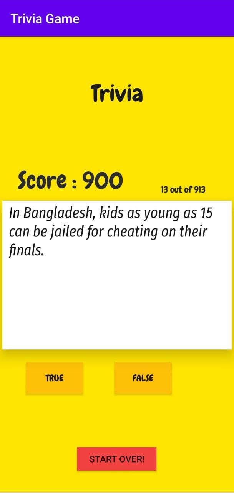
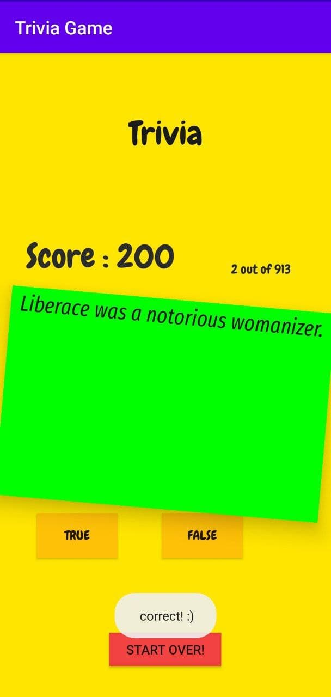
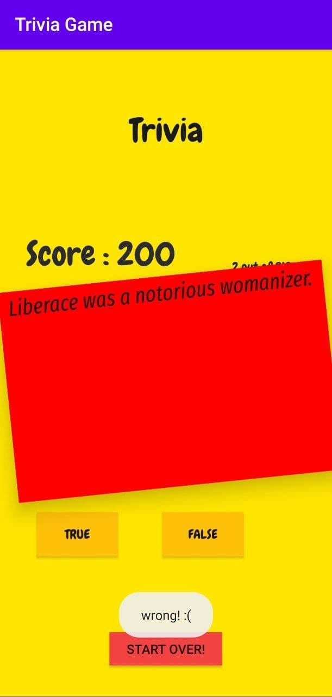

# trivia-quiz

While learning the Udemy course,
I Developed a simple Trivia Android app, applying the MVC pattern. 
The app is basically a quiz app that parses a JSONArray API with 900 questions. 
Then show them in yes-or-no quiz form. Beautiful graphics are added to entertain the user while playing, all graphics created through XML code.

